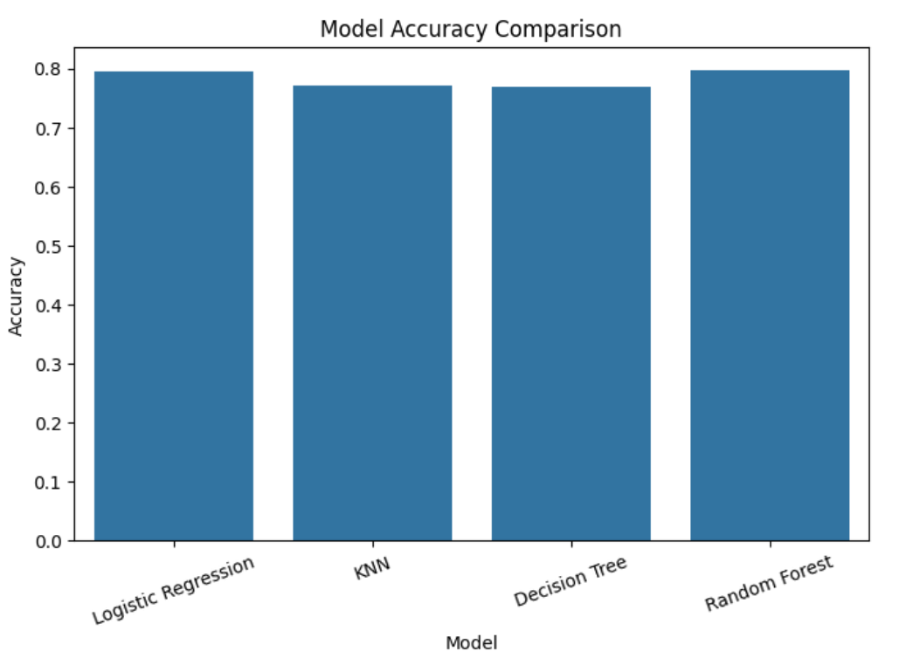
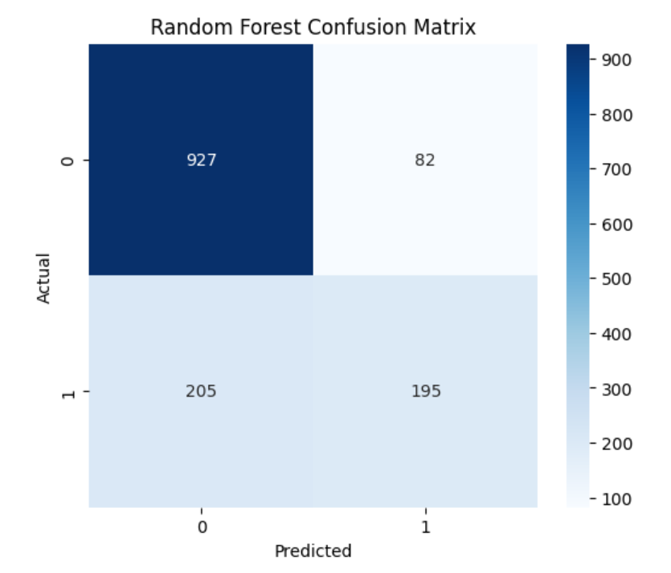
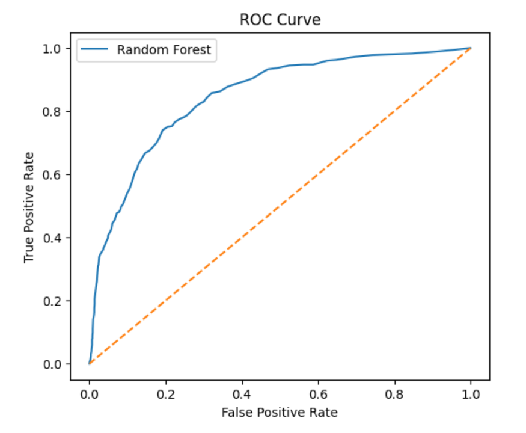
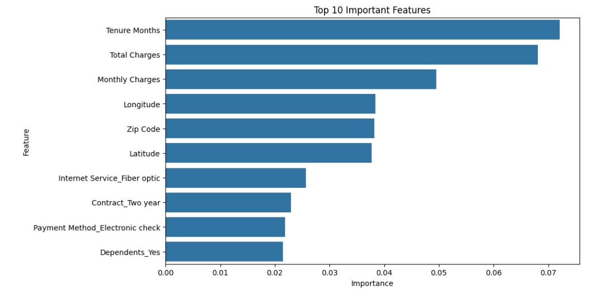

# 📊 Customer Churn Prediction using Machine Learning

## 📌 Project Overview

Customer churn is one of the biggest challenges faced by telecom companies. Predicting whether a customer is likely to leave helps businesses improve customer retention and reduce revenue loss.

This project builds an end-to-end Machine Learning pipeline to predict customer churn using customer demographic and service usage data. Multiple classification algorithms were trained and compared, and the best-performing model was selected based on evaluation metrics.

## 🎯 Objectives

- Perform data cleaning and preprocessing
- Explore the dataset using Exploratory Data Analysis (EDA)
- Encode categorical features
- Train multiple Machine Learning classification models
- Compare model performance
- Perform Hyperparameter Tuning
- Evaluate the best model
- Save the trained model for future predictions

---

## 📁 Project Structure

```
Customer-Churn-Prediction/
│
├── data/
│   └── customer_churn_cleaned.csv
│
├── model/
│   └── random_forest_model.pkl
│
├── notebook/
│   └── customer-churn-prediction.ipynb
│
├── outputs/
│   ├── Feature_Importance.csv
│   ├── Model_Comparison.csv
│   └── images/
│       ├── confusion_matrix.png
│       ├── feature_importance.png
│       ├── model_comparison.png
│       └── roc_curve.png
│
├── requirements.txt
├── LICENSE
└── README.md
```

## 📂 Dataset

The project uses a Customer Churn dataset containing customer demographics, account information, and subscribed services.

### Target Variable

- **Churn Value**
  - 0 = Customer Stayed
  - 1 = Customer Left

## 🛠 Technologies Used

- Python
- NumPy
- Pandas
- Matplotlib
- Seaborn
- Scikit-learn
- Joblib
- Jupyter Notebook

## 📊 Exploratory Data Analysis

The following analyses were performed:

- Dataset Overview
- Missing Value Analysis
- Data Type Conversion
- Distribution of Numerical Features
- Correlation Heatmap
- Feature Importance Analysis

## 🤖 Machine Learning Models

The following classification models were trained and compared:

- Logistic Regression
- K-Nearest Neighbors (KNN)
- Decision Tree Classifier
- Random Forest Classifier

## 📈 Model Evaluation

The models were evaluated using:

- Accuracy Score
- Classification Report
- Confusion Matrix
- ROC Curve
- Cross Validation
- Hyperparameter Tuning (GridSearchCV)

## 🏆 Best Model

After comparing all models, the **Random Forest Classifier** achieved the best overall performance and was selected as the final model.

## 📷 Project Outputs

### Model Comparison



### Confusion Matrix



### ROC Curve



### Feature Importance



## 💾 Saved Model

The trained Random Forest model has been saved using Joblib.

model/random_forest_model.pkl

## 🚀 How to Run the Project

### Clone the repository

```bash
git clone https://github.com/yourusername/Customer-Churn-Prediction.git
```

### Navigate to the project directory

```bash
cd Customer-Churn-Prediction
```

### Install dependencies

```bash
pip install -r requirements.txt
```

### Open the notebook

```bash
jupyter notebook
```

Run the notebook:

```
notebook/customer-churn-prediction.ipynb
```

## 📌 Future Improvements

- Deploy the model using Streamlit
- Build an interactive web application
- Improve prediction accuracy through advanced feature engineering
- Experiment with XGBoost, LightGBM, and CatBoost
- Perform automated hyperparameter optimization

## 👨‍💻 Author

**MINAHIL FATIMA**

Machine Learning Enthusiast

GitHub: https://github.com/Minnu1-ai
 
LinkedIn: https://linkedin.com/in/minahil-fatima-2a4a3941a

## ⭐ If you found this project helpful, please consider giving it a Star!
